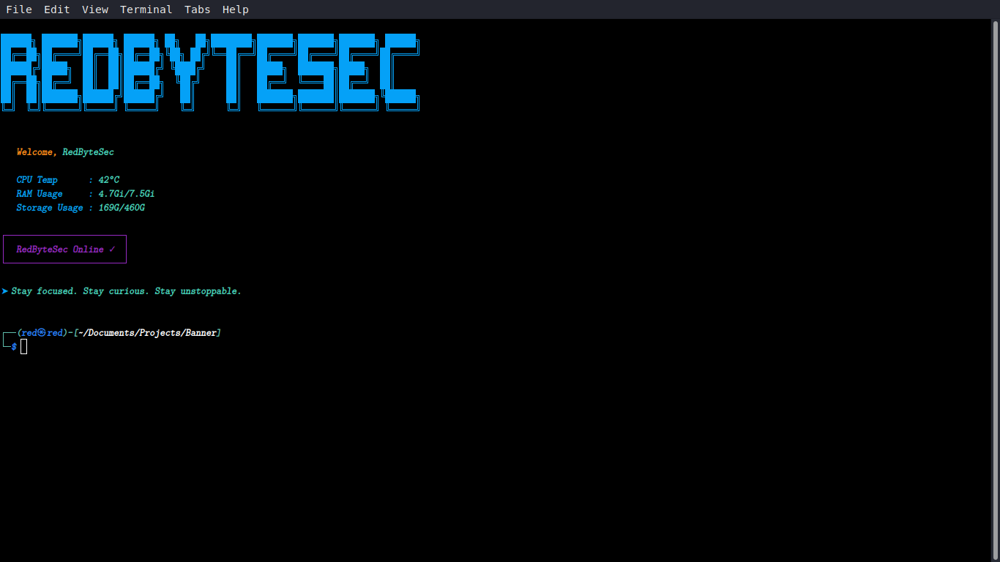

# Simple Banner Installer

This script allows you to install a personalized and informative banner (Message Of The Day - MOTD) for your terminal. The banner displays your username in ASCII art, along with useful system information like CPU temperature, RAM usage, and storage usage.



## Features

*   **Personalized Welcome:** Displays your chosen username in a large ASCII art banner.
*   **System Information:** Shows current CPU temperature, RAM usage, and storage usage.
*   **Dependency Check:** Automatically checks for required tools (`figlet`, `toilet`, `bc`, `wget`) and guides you to install them if missing.
*   **Easy Management:** Provides options to install, preview, and uninstall the banner.

## Prerequisites

Before running the script, ensure you have the following packages installed on your system:

*   `figlet`
*   `toilet`
*   `bc`
*   `wget`

The script will attempt to detect missing packages and provide installation commands for `apt`, `dnf`, and `pacman` based systems.

## Installation

1.  **Make the script executable:**
    ```bash
    chmod +x start.sh
    ```
2.  **Run the script:**
    ```bash
    ./start.sh
    ```
3.  **Follow the prompts:**
    *   Choose option `1) Install Banner`.
    *   Enter your preferred username when prompted.

The script will create a hidden file (`.my_banner.sh`) in your home directory and add a line to your `~/.bashrc` (or `~/.zshrc` if you use zsh) to execute it on every new terminal session. It will also back up your existing `~/.bashrc` to `~/.bashrc.backup`.

## Usage

After successful installation, simply open a new terminal session. Your personalized banner with system information will be displayed automatically.

## Preview

To see how your banner will look without fully installing it:

1.  Run the script:
    ```bash
    ./start.sh
    ```
2.  Choose option `2) Preview Banner`.
3.  Enter a username for the preview.

## Uninstallation

To remove the banner and restore your `~/.bashrc` (or `~/.zshrc`):

1.  Run the script:
    ```bash
    ./start.sh
    ```
2.  Choose option `3) Uninstall / Restore`.

This will remove the line added to your `~/.bashrc` (or `~/.zshrc`) and delete the `.my_banner.sh` script. Your `~/.bashrc.backup` will remain untouched.
